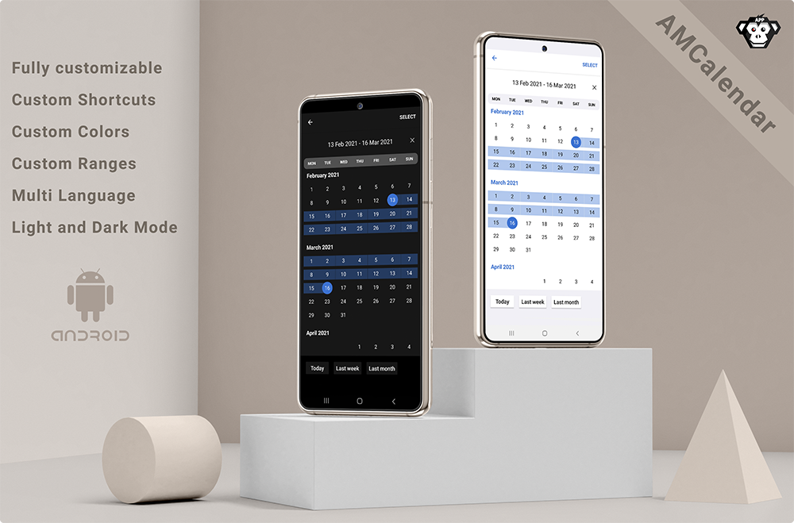

[](https://jitpack.io/#appmonkey8010/AMCalendar)
[](https://en.wikipedia.org/wiki/MIT_License)

AMCalendar - Android Date Picker
=============== 

AMCalendar is a fully customisable widget for picking dates and ranges based on the native [Calendar](https://developer.android.com/reference/java/util/Calendar).

It's an Android port of the [Fastis iOS Calendar Framework](https://github.com/simla-tech/Fastis) by [Simla.Tech ](https://github.com/simla-tech) build from scratch.

- [Features](#features)
- [Installation](#installation)
- [Usage](#usage)
  - [Quick Start](#quick-start)
  - [Single and range modes](#single-and-range-modes)
  - [Configuration](#configuration)
  - [Shortcuts](#shortcuts)
  - [Customization](#customization)
- [License](#license)

## Features

- [x] Flexible customization
- [x] Shortcuts for dates and ranges
- [x] Single date and date range modes

## Installation

Add this to your root gradle:

```groovy
allprojects {
    repositories {
        maven { url "https://www.jitpack.io" }
    }
}
```

Add this to your module's gradle dependencies:

```groovy
dependencies {
    implementation 'com.github.appmonkey8010:amcalendar:[RELEASE]' //e.g.: 1.0.0
}

```

## Usage

### Quick Start

```kotlin
import at.appmonkey.amcalendar.base.AMCalendar

class MainActivity : AppCompatActivity() {

    AMCalendar.rangeSelect(this, object : RangeSelectionListener {
            override fun onRangeSelect(cal1: Calendar?, cal2: Calendar?) {
                ...
            }
        }).shortcuts(TodayRangeShortcut(this), LastWeekRangeShortcut(this))
            .show()

}
```

### Single and range modes

If you want to get a single date, you have to use the `SingleAMCalendar` implementation:

```kotlin
AMCalendar.singleSelect(this, object : SingleSelectionListener {
    override fun onSingleSelect(cal: Calendar?) {
        if(cal != null) {
            Log.v("AMCalendar", cal.toString())
        }
    }
}).preselect(Calendar.getInstance())
    .show()
```

If you want to get a date range, you have to use the `RangeAMCalendar` implementation:

```kotlin
AMCalendar.rangeSelect(this, object : RangeSelectionListener {
    override fun onRangeSelect(cal1: Calendar?, cal2: Calendar?) {
        if(cal1 != null && cal2 != null) {
            Log.v("AMCalendar", cal1.toString())
            Log.v("AMCalendar", cal2.toString())
        }
    }
}).preselect(Calendar.getInstance(), Calendar.getInstance())
    .show()
```

### Configuration

- `shortcuts`- Shortcuts array. The default value is `null`. See [Shortcuts](#shortcuts) section
- `preselect`- An initial value which will be selected by default. The default value is `null`.

### Shortcuts

Using shortcuts allows you to select set dates or date ranges quickly.
By default `shortcuts` is null. The bottom container will be hidden if you don't provide any shortcuts.

In AMCalendar available some prepared shortcuts for each mode:

- For **`SingleAMCalendar`**: `TodaySingleShortcut`, `TomorrowSingleShortcut`, `YesterdaySingleShortcut`
- For **`RangeAMCalendar`**: `TodayRangeShortcut`, `LastWeekRangeShortcut`, `LastMonthRangeShortcut`

Also, you can create your own shortcut:

```kotlin
class CustomRangeShortcut : AMCalendarRangeShortcut() {

  init {
    cal1 = Calendar.getInstance()
    cal2 = null
    text = "Today"
  }

}
```

```kotlin
AMCalendar.rangeSelect(...)
    .shortcuts(CustomRangeShortcut(), LastWeekRangeShortcut(context))
```

### Customization

AMCalendar's appearance can be customized with resources. Following keys can be overridden:

```
<!-- colors.xml -->
<color name="colorAMCalendarBackground">#ffffff</color>
<color name="colorAMCalendarCancel">#3c72d1</color>
<color name="colorAMCalendarSelect">#3c72d1</color>
<color name="colorAMCalendarDisabled">#bebebe</color>
<color name="colorAMCalendarHeaderDisabled">#bebebe</color>
<color name="colorAMCalendarHeaderSelected">#000000</color>
<color name="colorAMCalendarHeaderClear">#4b4b4b</color>
<color name="colorAMCalendarWeekday">#000000</color>
<color name="colorAMCalendarWeekdayBackground">#f0f0f6</color>
<color name="colorAMCalendarMonth">#3c72d1</color>
<color name="colorAMCalendarDay">#000000</color>
<color name="colorAMCalendarDaySelected">#FFFFFF</color>
<color name="colorAMCalendarDaySelectedCircle">#3c72d1</color>
<color name="colorAMCalendarShortcutBackground">#f0f0f6</color>
<color name="colorAMCalendarShortcutElementBackground">#FFFFFF</color>
<color name="colorAMCalendarShortcutElementText">#000000</color>
```

By default the library provides a light and a dark theme.

```
<!-- strings.xml -->
<string name="amcalendar_select">Select</string>
<string name="amcalendar_please_select_date">Please select date</string>
<string name="amcalendar_please_select_date_range">Please select date range</string>
<string name="amcalendar_template_today">Today</string>
<string name="amcalendar_template_tomorrow">Tomorrow</string>
<string name="amcalendar_template_yesterday">Yesterday</string>
<string name="amcalendar_template_last_week">Last week</string>
<string name="amcalendar_template_last_month">Last month</string>
<string name="amcalendar_monday_short">MON</string>
<string name="amcalendar_tuesday_short">TUE</string>
<string name="amcalendar_wednesday_short">WED</string>
<string name="amcalendar_thursday_short">THU</string>
<string name="amcalendar_friday_short">FRI</string>
<string name="amcalendar_saturday_short">SAT</string>
<string name="amcalendar_sunday_short">SUN</string>
```

By default the library provides following languages:
- **English (default)**
- **German**

<a href="https://www.paypal.com/donate/?hosted_button_id=MEPM8RFRH47AS">
  
</a>

## License

AMCalendar is released under the MIT license. See LICENSE for details.